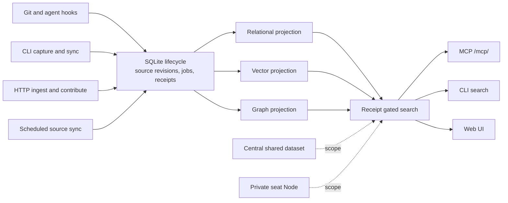

# Citadel Archive

Self-hosted Organization Vault and seat capture CLI built on Cognee.

[](https://github.com/masumi-network/Citadel/actions/workflows/test.yml)
[](LICENSE)
[](pyproject.toml)

<p align="center">
  
</p>

## What it does

Citadel captures source material, keeps the accepted revision in SQLite, and projects it into relational, vector, and graph stores. Search returns data that has a current projection receipt. Central stores shared memory. Each seat has a private Node.

Capture enters through the CLI, HTTP writes, Git hooks, Claude Code hooks, and scheduled source sync. People use the web UI or CLI. Agents use the hosted MCP endpoint.

<p align="center">
  
</p>

## Architecture



## Quick start

### Use the hosted Node

The base package installs the lightweight `citadel` CLI. Set a seat token when `citadel onboard` asks for one.

```bash
python -m pip install citadel-archive
citadel onboard
citadel status
citadel search "what did we decide about the vault?"
```

For a headless setup, keep the token in the environment:

```bash
export CITADEL_MCP_ACCESS_TOKEN=ctdl_...
citadel onboard --non-interactive --json
citadel status --json --check-search
```

### Run the Lite runtime from source

Use Python 3.11 or newer. Export the deployment variables required by `kb.lite_runtime` before starting it.

```bash
uv sync --all-extras --dev
# Export the runtime variables required by kb.lite_runtime.
uv run python -m kb.lite_runtime
```

### Run with Docker Compose

Docker Compose starts the Qdrant service and the Citadel service. It binds Citadel to `127.0.0.1:8000` by default.

```bash
cp .env.lite.example .env
# Replace every CHANGE_ME value in .env.
docker compose --env-file .env up --build
```

## Connect an agent

Citadel exposes a streamable HTTP MCP endpoint at `/mcp/`. Use a bearer token in the request header. `citadel onboard` can write this project configuration for you.

```json
{
  "mcpServers": {
    "citadel": {
      "type": "http",
      "url": "https://citadel.utxo.ag/mcp/",
      "headers": {
        "Authorization": "Bearer ${CITADEL_MCP_ACCESS_TOKEN}"
      }
    }
  }
}
```

Use one seat per human. Keep each agent process on its own seat-bound token. Search with `citadel_search` before editing. Rate a result with `citadel_record_feedback` when a user asks for feedback capture.

## Capabilities and surfaces

| Capability | Surface | Contract |
|---|---|---|
| Search | `POST /search`, `citadel_search`, `citadel search`, web search page | Reader access with `kb:search`; responses include hits and may include `search_id`. |
| Feedback | `POST /feedback`, `citadel_record_feedback`, `citadel feedback`, dashboard form | Writer access with `kb:feedback`; link feedback to a search or result ID. |
| Promotion | `/api/promotion/pending`, `citadel_promotion_pending`, `citadel_promotion_approve`, `citadel_promotion_reject`, `citadel promotion` | Review Node to Central candidates; approval and rejection require admin access. |
| Graph UI | `/api/mesh/graph`, `/next/app/graph`, `/app` | Reader access with `kb:search`; graph reads follow the caller dataset scope. |
| Hooks | `citadel onboard`, Git `pre-push`, Claude Code `SessionStart`, `UserPromptSubmit`, and `SessionEnd` | Captures approved work and injects bounded search context. Hook failures exit silently. |

## Security and privacy

Seat isolation. `seat:<slug>` datasets are private by default. A seat can read Central and its own Node. Other seat Nodes are denied.

Shared telemetry. Search rows that land in a shared dataset carry presence data only. Query text and hit IDs stay on the caller's Node when a seat Node is available.

Canary writes. Production write tests target `seat:canary`. Promotion is disabled by default and runs in dry-run mode by default. Approving a pending promotion requires admin access.

Hook transport. Hooks read `CITADEL_MCP_ACCESS_TOKEN` from the environment, require HTTPS, refuse redirects, and return exit code 0 on failures.

Provider settings. Graph extraction needs an LLM key. `LLM_ENDPOINT` and `EMBEDDING_ENDPOINT` control provider destinations, so review those values before storing sensitive text.

## Known limits

Measurements are dated. A warm 2026-08-17 run of CLI 0.5.1 returned successful searches at a 25,049 ms p50 for one query, with 20 of 20 searches returning results. A 2026-08-03 frozen harness measured `answer_recall@5` at 0.8974 over 39 span-bearing questions. That harness also found 892 of 2,867 accepted documents with zero vector chunks. Text after roughly the first 1,500 characters can be missed. These figures do not measure the whole corpus.

See [`docs/performance.md`](docs/performance.md) for test conditions, definitions, and reproduction commands.

## Documentation

Start with [Architecture](docs/architecture.md), [Operations](docs/operations.md), [MCP setup and tool reference](docs/mcp/README.md), [Domain language](CONTEXT.md), [Performance](docs/performance.md), or the [architecture decision records](docs/adr/).

## Contributing

See [`CONTRIBUTING.md`](CONTRIBUTING.md) for the development setup, checks, and pull request rules. Report vulnerabilities through [`SECURITY.md`](SECURITY.md), not a public issue.

## License

Apache-2.0. See [`LICENSE`](LICENSE).
